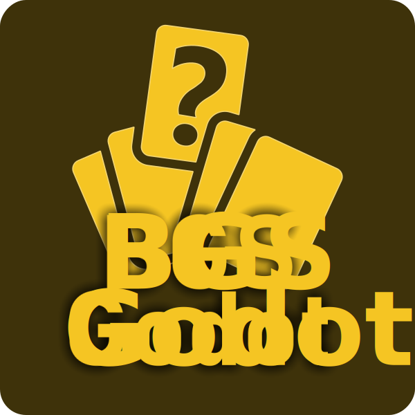

  

<h3 align="center">Board Game Studio Godot</h3>

---

 Addon for Godot. Transforming it into a Board Game Design / Development tool
      

## 📝 Table of Contents

- [Introduction / Disclaimer](#about)
- [Showcase](#showcase)
- [Installation](#Installation)
- [Built Using](#built_using)
- [TODO](TODO.md)
- [Authors](#authors)

## 🧐 Introduction / Disclaimer 

*BGS Godot*, or "Board Game Studio - Godot", is an attempt to transform Godot into a development tool for board games, whether virtual or physical. You can use the editor to design board game element templates that can be intuitively and code-free connected to your database, and then used to generate sprite sheets for quick prototyping or even production.

As of now, the codebase is very rough. I implemented barebones functionality during a 12-hour session as a proof of concept. I'm searching for collaborators and testers. Please see more details in my showcase below.

## 🏁 Getting Started 

### Todo: Video

## 💻 Installation 

**Drag & Drop**  the contents of the "addons"-folder into your projects "addons"-folder and activate it in the project settings (u know the drill)

## ⛏️ Built Using 

- [Godot](https://godotengine.org/)

## ✍️ Authors 

- [@drgndrp](https://github.com/drgndrp) - Idea & Initial work

See also the list of [contributors](https://github.com/drgndrp/BGS-Godot/contributors) who participated in this project.

---
Logo Created on [Games-Icons.net](https://game-icons.net/) using images by [Faithtoken](http://www.faithtoken.com/) under 
[CC BY 3.0][cc-by].

[![CC BY 4.0][cc-by-image]][cc-by]

[cc-by]: http://creativecommons.org/licenses/by/3.0/
[cc-by-image]: https://i.creativecommons.org/l/by/3.0/88x31.png
[cc-by-shield]: https://img.shields.io/badge/License-CC%20BY%204.0-lightgrey.svg